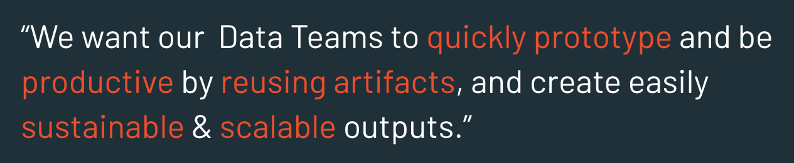
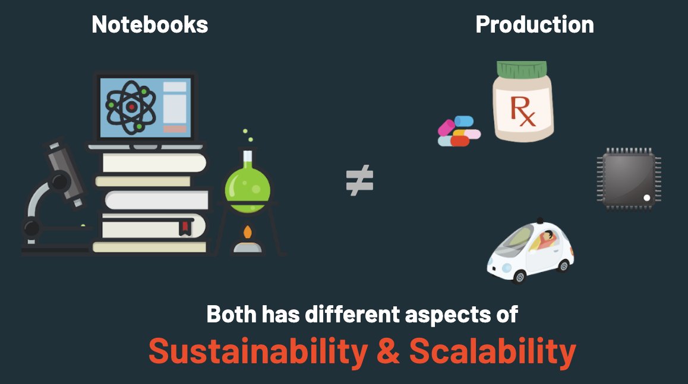
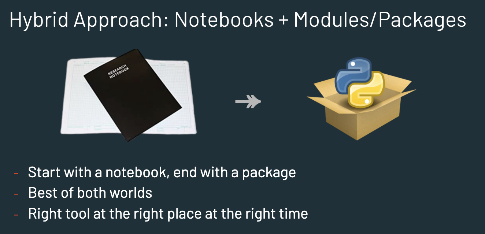
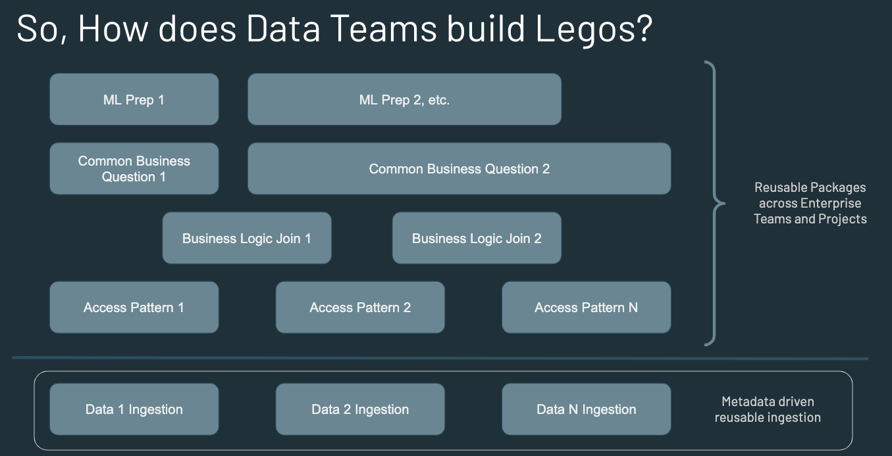

# Enterprise Scalable Data Science/Engineering Project Template

> In large enterprises, its not about how easy it is to build a new solution, but how easy it is to sustain, maintain, and scale a solution. 

Notebooks may be the in-thing that every data scientist or data engineer, who is just getting started with the field, may use. Notebooks are a great tool for experimenting data analysis or project, but it is not designed as a scalable solution for production. 

## What does using Notebooks lead to in Enterprises?
- Good for kaggle, MooCs
- Single notebook structure leads to Spaghetti Code and Big Ball of Mud
- Poor maintainability 
- Poor scalability
- Poor testability 
- Poor integrability
- Poor reusability
- In summary, 
  - Poor best practices for enterprise needs

# But What does Enterprises want?

## When to use Notebooks?
- Kaggle, MooCs
- As a scratch pad
- Ad hoc analysis
- One time analysis
- Experiments
- Quick POC
- Team showcasing analysis results to others

But remember,

# Hybrid Approach

# Benefits of Hybrid Approach
- Quick and easy to get started and begin prototyping with notebooks
- Transition to ‘coded with best practices’ with ease 
- Get full features of IDE from integrated terminal, code debug, variable inspectors, tabbed environments, autocomplete, intellisense, etc.
- Natural workflows and integrations with SCM/Git
- Easy to build test scripts, integrate with CI/CD pipelines
- Uses battle tested SDLC practices with Object Oriented Principles
- Modular & Reusable package along with above benefits leads to macro productivity of Enterprise Data Teams that produce Sustainable & Scalable solutions

# Enterprise Teams building the stack
